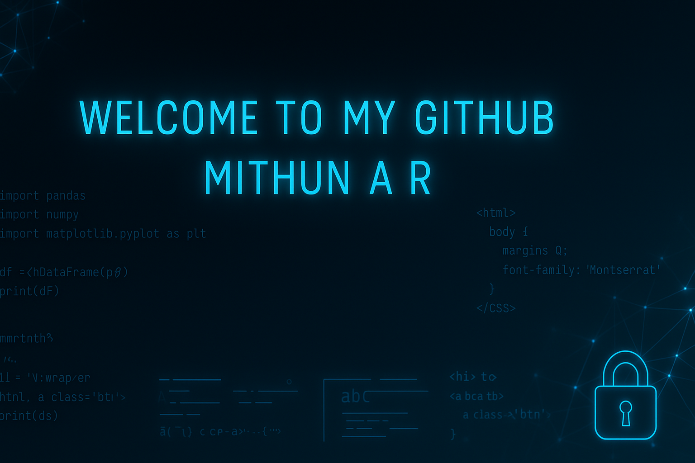

# 👋 Hey there, I’m Mithun A R!

🎓 **B.Tech – Artificial Intelligence & Data Science** (2022–2026)  
💻 **Aspiring Web Developer** passionate about designing, developing, and maintaining innovative software solutions.  
📍 **Jai Shriram Engineering College** | Problem Solver | Lifelong Learner  

---

## 🔧 Tools & Technologies
- Python  
- SQL  
- HTML, CSS  

---

## 🎯 Areas of Interest
- Machine Learning 
- Data Analytics  

---

## 🚀 Highlight Projects
- **Ethical Investigation of AI in Healthcare**  
  🩺 Machine Learning model to analyze health conditions using parameters like blood pressure, sugar level, etc.

- **Finance Management App**  
  📱 Developed using Kotlin to manage expenses, set spending limits, and track budgets with a user-friendly interface.

---

## 🏅 Achievements & Roles
- Symposium Coordinator (2024–2025)  
- Completed Python & Machine Learning internships  
- Workshops attended on AI development and Machine Learning applications  

---

## 📜 Certifications
- **Project Development using Paradigms** – IDM Tech Park  
- **React JS** – Skill Tamil Nadu  

---

## 🎯 2025 Goals
- Build impactful and user-centric web projects  
- Explore deeper into cybersecurity and AI applications  

---

## 🤝 Connect with Me
- **LinkedIn:** [linkedin.com/in/mithun-arun-887600333](https://www.linkedin.com/in/mithun-arun-887600333)  
- **GitHub:** [github.com/Mithun1414](https://github.com/Mithun1414)  
- **Email:** mithunarun2028@gmail.com  

---

💬 **Quote I Live By**  
_"The only way to do great work is to love what you do."_ — Steve Jobs
